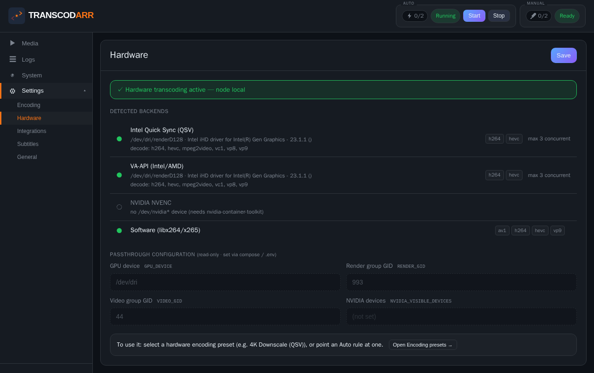
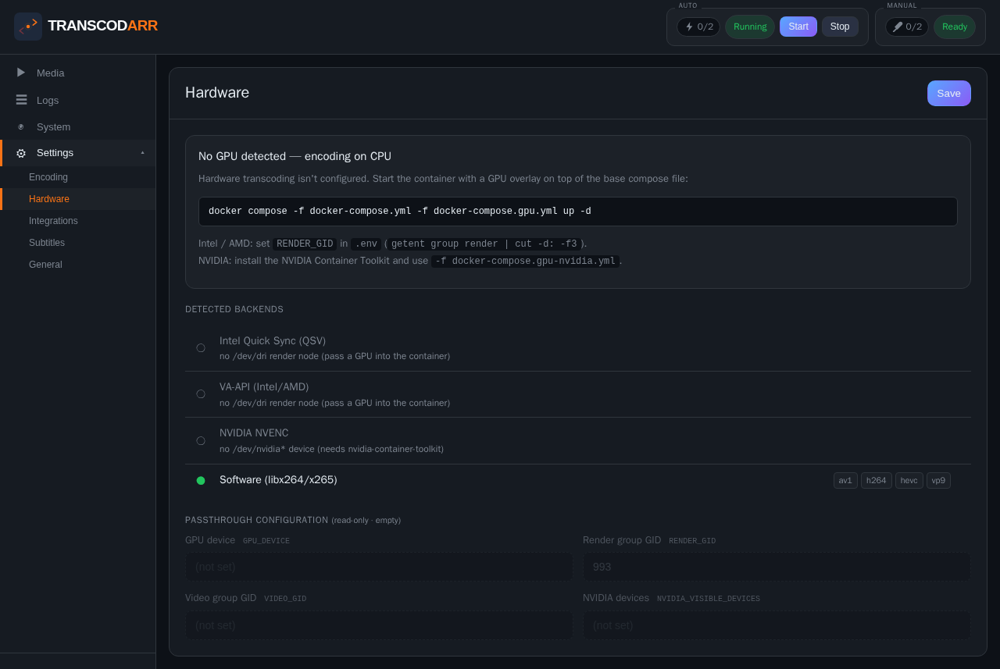
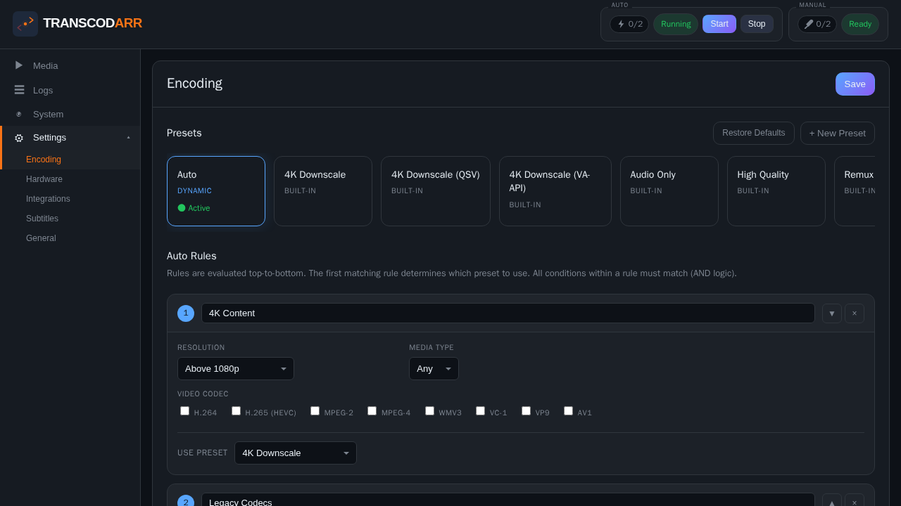

# Transcodarr

Automated video transcoding orchestrator for the *arr ecosystem. Watches for new media, transcodes to a universal direct-play format with embedded subtitles, updates Radarr/Sonarr paths, and refreshes your Jellyfin library — all hands-off.

Built for homelabbers who want their entire library in a consistent, streaming-friendly format without manual intervention.


*Movies library in tile view — switch between tile and table layouts, infinite-scroll pagination, server-side filter and sort.*

## What It Does

```
Download Client ──► Watch Folder ──► Transcodarr ──► Output Library
                                         │
                        ┌────────────────┼────────────────┐
                        ▼                ▼                ▼
                   Fetch Subs      Transcode        Post-Process
                   (OS.com,       (FFmpeg with      (Update Radarr/
                   Podnapisi,      progress)        Sonarr paths,
                   Addic7ed)                        refresh Jellyfin,
                        │                           cleanup source)
                        ▼
                   Sync Subs
                   (ffsubsync)
```

1. **Watchdog** monitors your download folder for new/moved files
2. **Subtitle pipeline** fetches, extracts, and syncs subtitles automatically
3. **FFmpeg** transcodes to your target format with real-time progress
4. **Post-processing** updates Radarr/Sonarr, refreshes Jellyfin, cleans up source files

## Features

**Transcoding**
- Encoding presets — built-in profiles (Audio Only, Remux + Subs, 4K Downscale, High Quality) plus custom user presets
- **Auto preset** — dynamic rule-based preset selection per-file based on resolution, video codec, and media type (movie vs TV)
- Per-stream control — encode or copy (passthrough) video and audio independently
- Configurable video codec (H.264, H.265, VP9, AV1), audio codec, container, resolution, preset, CRF
- Dual worker pool: separate auto (watchdog) and manual (UI-triggered) workers, both resizable live
- Batch transcode mode with batch tracking and stop controls for re-encoding existing libraries
- Real-time progress tracking with percentage and file size
- Output verification (duration, streams, file size sanity checks)


*Each preset exposes the full encoder dial-set: video codec, container, resolution, FFmpeg preset, profile, CRF, and the matching audio chain.*

**Subtitles**
- Multi-provider fetching: OpenSubtitles.com, Podnapisi, Addic7ed
- Multi-account rotation for rate-limited providers
- Audio-based subtitle synchronization via ffsubsync
- Embedded subtitle extraction and format conversion
- Per-provider enable/disable toggles and timed cooldowns

**Integrations**
- **Radarr** — auto-updates movie paths after transcode, optional source cleanup
- **Sonarr** — auto-updates episode paths, handles series path updates for ended series
- **Jellyfin** — automatic library refresh after transcode
- **TMDB/OMDB** — metadata enrichment, poster fetching
- Path remapping support for Docker/VM environments

**UI & Monitoring**
- Single-page web interface with dark theme
- Media browser with movie/TV tabs, filtering, sorting, batch actions
- Settings management — all encoding, integration, and provider settings configurable in-browser
- Real-time CPU, RAM, and disk usage charts (24h history)
- Storage trending over time (90-day retention)
- Live log viewer
- Connection testing for Radarr/Sonarr


*TV episode browser. Same library, different layout — table view shows episode codes, resolution, size, and status at a glance.*


*Click any title to inspect the full media metadata, file path, and transcode history.*

## Quick Start

### 1. Configure your `.env`

```bash
cp .env.example .env
```

Edit `.env` and set these required values:

```bash
# Where your media lives (any folder names, any drives)
MOVIES_WATCH_PATH=/path/to/downloads/movies   # Where download client drops movies
TV_WATCH_PATH=/path/to/downloads/tv           # Where download client drops TV
MOVIES_OUTPUT_PATH=/path/to/library/movies    # Transcoded movies go here (Jellyfin/Plex root)
TV_OUTPUT_PATH=/path/to/library/tv            # Transcoded TV goes here (Jellyfin/Plex root)

# Database
POSTGRES_PASSWORD=pick-a-strong-password

# Security (change these to random strings)
FLASK_SECRET=change-me-to-a-random-string
ADMIN_API_KEY=change-me-to-a-random-string
```

> **Important:** Watch and output paths must be different locations. Watch paths are a processing area where your download client drops files — do not point them at your existing media library.

Movies and TV can live on completely separate drives or NAS mounts. The folders can be named anything.

### 2. Start the container

**With bundled Postgres** (recommended for new setups):
```bash
docker compose -f docker-compose.postgres.yml up -d --build
```

**With an external Postgres instance** (set `POSTGRES_HOST` in `.env`):
```bash
docker compose up -d --build
```

### 3. Configure in the UI

Open `http://localhost:5025` and set up through the Settings page:

1. **Encoding** — Choose your target codec, resolution, preset, CRF
2. **Integrations** — Add Radarr/Sonarr URLs and API keys for path management, Jellyfin for library refresh
3. **Subtitles** — Enable providers and add accounts (OpenSubtitles.com requires login)
4. **General** — Verify your media paths are correct, set worker counts

Click **Start** in the header to begin watching for new files.

**Typical flow:** Download client saves file → watch path → Transcodarr transcodes → output path → Radarr/Sonarr paths updated → Jellyfin refreshes.

### Re-encode Only Mode

If you don't use Radarr/Sonarr and just want to re-encode an existing library, skip the watch paths:

```bash
cp .env.example .env
# Edit .env — set only MOVIES_OUTPUT_PATH and TV_OUTPUT_PATH to your existing library
# Leave MOVIES_WATCH_PATH and TV_WATCH_PATH blank
docker compose -f docker-compose.reencode.yml up -d --build
```

The watchdog is disabled in this mode. Use the web UI to browse your library and trigger batch re-encodes manually. Files are processed in-place — copied to temp, transcoded, then the original is replaced.

## Hardware Transcoding

Offload transcoding to your GPU. Transcodarr runs the **whole pipeline on the GPU** — decode, scale, HDR tone-map, and encode — so frames never touch the CPU. On an Intel UHD 630 this measured **~4× faster wall-clock and ~13× less CPU** than software for a 4K→1080p H.264 job.

It's fully **opt-in**: the base image and `docker-compose.yml` stay GPU-less and work everywhere. You enable hardware by layering a GPU compose file on top.

### 1. Enable GPU access

**Intel (Quick Sync / VA-API) or AMD (VA-API):**
```bash
# find your host's "render" group GID — it varies by distro
#   Ubuntu 24.04: 993   ·   Debian 12: 106
getent group render | cut -d: -f3

# put it in .env, then start with the GPU overlay
echo "RENDER_GID=993" >> .env      # use the value from above
docker compose -f docker-compose.yml -f docker-compose.gpu.yml up -d --build
```

**NVIDIA (NVENC):** install the [NVIDIA Container Toolkit](https://docs.nvidia.com/datacenter/cloud-native/container-toolkit/latest/install-guide.html), then:
```bash
docker compose -f docker-compose.yml -f docker-compose.gpu-nvidia.yml up -d --build
```

### 2. Confirm it's detected

Open **Settings → Hardware**. Transcodarr *probes* each backend (it runs a real test encode, so it only advertises what actually works on your hardware) and shows the encode/decode codecs and your passthrough config:



If it says **"No GPU detected"**, the section greys out and tells you exactly what to fix:



### 3. Use it

Hardware vs. software is a property of each **encoding preset** (the `Encode Backend` setting), so you control it exactly like every other encoding choice. When a GPU is detected, ready-made presets are created for it automatically — an Intel box gets **`4K Downscale (QSV)`** and **`4K Downscale (VA-API)`**. Activate one, or point an Auto rule's **Use Preset** at it to route by source:



### What's supported

| Backend | Hardware | Encode | Decode | HDR tone-map |
|---|---|---|---|---|
| **Intel Quick Sync (QSV)** | Intel iGPU | H.264, HEVC | H.264/HEVC/VP9/MPEG-2/VC-1 | via software |
| **VA-API** | Intel / AMD | H.264, HEVC | (same, driver-dependent) | on GPU (VA-API / OpenCL) |
| **NVIDIA NVENC** | NVIDIA GPU | H.264, HEVC | H.264/HEVC/VP9/AV1¹ | via software |
| **Software** | any CPU | H.264/HEVC/VP9/AV1 | anything | on CPU |

- **Automatic fallback, never a failed job.** If a backend, codec, or source isn't hardware-decodable (e.g. an AV1 source on a GPU without AV1 decode), that job transparently drops to software — the logs say which.
- **HDR → SDR tone-mapping on the GPU** when your target is 8-bit (H.264). VA-API is used when the source carries HDR10 mastering-display metadata, OpenCL otherwise; both fall back to the software tone-mapper.
- **Concurrency cap.** GPUs have hard session limits (an Intel iGPU sustains ~3 concurrent 1080p encodes; consumer NVIDIA cards are driver-capped at 2). `HW_MAX_WORKERS` (Settings → General) bounds hardware jobs across all workers; blank = auto-detected.

¹ Intel QSV/VA-API are the most tested paths. NVENC is implemented and gated behind the same detection + fallback, but the reference hardware is Intel — please report NVIDIA issues.

## Configuration

All runtime settings are stored in PostgreSQL and configurable through the UI. The app reads settings with this priority:

```
Database (UI settings) > Environment Variables > .env file > Defaults
```

### Encoding Settings

| Setting | Default | Description |
|---------|---------|-------------|
| `TARGET_VIDEO_CODEC` | `h264` | h264, h265, vp9, av1 |
| `TARGET_AUDIO_CODEC` | `aac` | aac, ac3, eac3, flac, opus |
| `TARGET_CONTAINER` | `.mp4` | .mp4, .mkv, .webm |
| `TARGET_RESOLUTION` | `1920x1080` | source, 720p, 1080p, 1440p, 4K |
| `TARGET_PRESET` | `fast` | ultrafast through veryslow |
| `TARGET_CRF` | *(codec default)* | 18-30 (lower = better quality, larger files) |
| `TARGET_AUDIO_BITRATE` | `448k` | 128k-448k |
| `TARGET_AUDIO_CHANNELS` | `6` | 2 (stereo), 6 (5.1), 8 (7.1) |
| `TARGET_AUDIO_NORMALIZE` | `true` | Loudness normalization (loudnorm) |
| `TARGET_HDR_MODE` | `auto` | HDR handling: `auto` (tonemap for h264, passthrough for av1/h265), `tonemap`, `passthrough` |
| `REQUIRE_SUBTITLES` | `true` | Skip transcode if no subs found (false = proceed without) |
| `FFMPEG_THREADS` | `1` | FFmpeg thread count (0 = auto) |
| `ENCODER_THREADS` | `4` | Video encoder thread count — applies to h264/h265/vp9/av1 (0 = auto) |

### Auto Preset Rules

The built-in **Auto** preset dynamically selects the right encoding preset per-file based on source properties. Rules are evaluated top-to-bottom (first match wins) and are configurable in the UI.

Default rules:

| Rule | Conditions | Target Preset |
|------|-----------|---------------|
| 4K Content | Above 1080p | 4K Downscale |
| Legacy Codecs | codec in [mpeg2, mpeg4, wmv3, vc1] | 4K Downscale |
| *Fallback* | *(no match)* | Audio Only |


*Build rules visually: select a resolution range and codec set, pick a target preset. The first matching rule wins; the fallback handles everything else.*

### Worker Pool

| Setting | Default | Description |
|---------|---------|-------------|
| `AUTO_WORKERS` | `2` | Workers for watchdog auto-transcodes (0 = disabled) |
| `MANUAL_WORKERS` | `0` | Workers for UI-triggered transcodes (0 = disabled) |

Both pools can be resized live from the UI without restarting.


*Live CPU/memory gauges with 24-hour history, current output disk usage, and a long-term storage trend chart so you can see your library grow.*

### Integration Settings

| Integration | Settings |
|-------------|----------|
| **Radarr** | `RADARR_URL`, `RADARR_API_KEY`, `RADARR_PATH_FROM`, `RADARR_PATH_TO` |
| **Sonarr** | `SONARR_URL`, `SONARR_API_KEY`, `SONARR_PATH_FROM`, `SONARR_PATH_TO` |
| **Jellyfin** | `JELLYFIN_URL`, `JELLYFIN_API_KEY` |

Path remapping (`PATH_FROM`/`PATH_TO`) translates container paths to Radarr/Sonarr's view of the filesystem.


*Each integration shows its live connection state: Connected, Configured (URL+key set, not test-pinged), or Not Configured.*

### Subtitle Providers

| Provider | Auth Required | Cooldown | Notes |
|----------|--------------|----------|-------|
| OpenSubtitles.com | Yes (multi-account supported) | 1 hour | Best coverage, rate-limited |
| Podnapisi | No | 15 min | Supplementary, Slovenian-focused |
| Addic7ed | Yes (multi-account supported) | 30 min | Good for TV episodes |

Provider order is configurable. Accounts rotate round-robin to distribute rate limits.


*Add multiple accounts per provider; Transcodarr round-robins through them and respects per-provider cooldowns to avoid rate-limits.*

## How It Works

### Transcode Pipeline

For each file detected by the watchdog:

1. **Check compatibility** — skip if already in target format
2. **Find subtitles** — check local `.srt` files, extract embedded subs, fetch from providers
3. **Sync subtitles** — run ffsubsync against audio track, pick best-aligned candidate
4. **Transcode** — FFmpeg encode with progress streaming to a `.tmp.mp4` in temp folder
5. **Verify output** — check duration, streams, file size against source
6. **Promote** — copy to staging file on output filesystem, atomic rename into place
7. **Post-process** — update Radarr/Sonarr paths, refresh Jellyfin, generate poster/NFO, cleanup source

### File Layout

```
MOVIES_WATCH_PATH/             # Incoming movies (any path)
  Movie Name (2020)/
    Movie Name (2020).mkv
    Movie Name (2020).meta.json  # Written by Radarr webhook

TV_WATCH_PATH/                 # Incoming TV (any path)
  Show Name/
    Season 01/
      Show Name - S01E01.mkv
      Show Name - S01E01.meta.json  # Written by Sonarr webhook

MOVIES_OUTPUT_PATH/            # Transcoded movies
  Movie Name (2020)/
    Movie Name (2020).mp4      # Transcoded with embedded subs
    Movie Name (2020).nfo
    poster.jpg

TV_OUTPUT_PATH/                # Transcoded TV
  Show Name/
    tvshow.nfo
    poster.jpg
    Season 01/
      Show Name - S01E01.mp4
      Show Name - S01E01.nfo

/temp/                         # Temp working files (cleaned automatically)
  movies/
    Movie Name (2020)/
      Movie Name (2020).tmp.mp4
      Movie Name (2020).progress.json
```

## API

All endpoints are under `/api` and require the `X-API-Key` header set to your `ADMIN_API_KEY` value. Key routes:

| Endpoint | Method | Description |
|----------|--------|-------------|
| `/api/start` | POST | Start watchdog + auto workers |
| `/api/stop` | POST | Stop watchdog + cancel queued jobs |
| `/api/status` | GET | Running state |
| `/api/settings` | GET/POST | Read/write all settings |
| `/api/transcode/manual` | POST | Queue a single file for transcode |
| `/api/transcode/batch` | POST | Queue multiple files by path (sequential, returns `batch_id`) |
| `/api/transcode/batch-by-filter` | POST | Queue every item matching a server-side filter — pairs with the UI's "select all matching" |
| `/api/transcode/batch/{batch_id}` | GET | List all jobs in a batch |
| `/api/transcode/batch/{batch_id}/stop` | POST | Stop a batch — kills current file + cancels remaining |
| `/api/transcode/stop` | POST | Stop a file — also stops its batch if part of one |
| `/api/transcode/jobs` | GET | List all transcode jobs + progress |
| `/api/transcode/jobs/{job_id}` | GET | Get a specific job |
| `/api/transcode/jobs/{job_id}` | DELETE | Cancel a queued job |
| `/api/media/movies` | GET | List movies (supports `q`, `status`, `sort`, `sort_order`, `page`, `page_size`) |
| `/api/media/tv` | GET | List TV episodes (same query params as movies) |
| `/api/media/pending` | GET | Pending files awaiting transcode (`q`, `sort`, `sort_order`, `limit`, `media_type`) |
| `/api/media/ignore` | POST | Toggle/add/remove ignore-list entry by path |
| `/api/media/ignore-by-filter` | POST | Bulk-ignore every pending item matching a filter |
| `/api/media/output-by-filter` | POST | Bulk-delete output files matching a filter (companion files included) |
| `/api/subtitles/search` | POST | Manually trigger subtitle search |
| `/api/system/stats` | GET | CPU/RAM/disk usage + 24h history |
| `/api/connections` | GET | Integration connection status |
| `/api/webhook/radarr` | POST | Radarr post-import webhook |
| `/api/webhook/sonarr` | POST | Sonarr post-import webhook |
| `/api/workers/status` | GET | Worker pool state |
| `/api/logs/tail` | GET | Live log tail (rotation-aware) |
| `/api/events/status` | GET (SSE) | Live stream of run state + worker pool changes |
| `/api/events/media` | GET (SSE) | Live stream of in-flight transcode progress + scan state |
| `/api/events/logs` | GET (SSE) | Live tail of the transcode log |
| `/api/events/system` | GET (SSE) | Live CPU/RAM/disk metrics |

### Sorting & Filtering

Media endpoints (`/api/media/movies`, `/api/media/tv`, `/api/media/pending`) support these query parameters:

| Parameter | Values | Description |
|-----------|--------|-------------|
| `q` | any string | Substring search across all fields |
| `status` | `all`, `ready`, `pending`, `processing`, `ignored` | Filter by status bucket |
| `sort` | `mtime`, `size_gb`, `title`, `year`, `show`, `season`, `episode` | Sort field |
| `sort_order` | `asc`, `desc` | Sort direction (default: `asc`) |
| `page` | integer ≥1 | Page number (default: `0` = no pagination) |
| `page_size` | integer | Items per page (default: `0` = return everything) |
| `limit` | integer | Legacy max-items cap, applied after sort if pagination is off |
| `media_type` | `movie`, `tv`, `all` | Filter by type (pending endpoint only) |

Paginated responses include `total_count`, `page`, `page_size`, and `has_more` so clients can build infinite-scroll or "X of Y" displays without a separate count call.

Example — get page 1 of pending movies that are ready, 50 per page, newest first:
```
GET /api/media/movies?status=ready&sort=mtime&sort_order=desc&page=1&page_size=50
```

### Batch Transcoding

Submit a batch to transcode multiple files sequentially on one worker:

```bash
curl -X POST http://localhost:5025/api/transcode/batch \
  -H "X-API-Key: YOUR_KEY" \
  -H "Content-Type: application/json" \
  -d '{"items": [
    {"file_path": "/downloads/movies/Movie A (2020)/Movie A (2020).mkv", "media_type": "movie"},
    {"file_path": "/downloads/movies/Movie B (2019)/Movie B (2019).mkv", "media_type": "movie"}
  ]}'
```

The response includes a `batch_id` you can use to monitor or stop the batch:

```bash
# Check batch progress
curl http://localhost:5025/api/transcode/batch/batch_1_1712345678 \
  -H "X-API-Key: YOUR_KEY"

# Stop the batch (kills current file, cancels remaining)
curl -X POST http://localhost:5025/api/transcode/batch/batch_1_1712345678/stop \
  -H "X-API-Key: YOUR_KEY"
```

Stopping a single file via `/api/transcode/stop` also stops the entire batch it belongs to.

## Webhooks (optional)

Webhooks let Radarr/Sonarr notify Transcodarr the moment a file is imported, so it can start transcoding immediately instead of waiting for the watchdog to pick it up.

In Radarr/Sonarr, go to **Settings → Connect → Add Webhook**:
- **Trigger**: "On Import" / "On Upgrade"
- **URL**: `http://transcodarr:5025/api/webhook/radarr` (or `.../sonarr`)

> **Note:** The `transcodarr` hostname works when both containers share a Docker network. If running on a separate host, use that host's IP/hostname instead.

## Requirements

- Docker
- PostgreSQL database (external or containerized)
- FFmpeg (included in Docker image)

### Hardware

Transcoding is CPU and memory intensive. Each worker runs a full FFmpeg process, so resource needs scale with your worker count.

| Workers | RAM | CPU Cores | Notes |
|---------|-----|-----------|-------|
| 1–2 | 4 GB | 4 | Comfortable for background transcoding |
| 3 | 8 GB | 6 | Usable but system will be near full load |
| 4+ | 16 GB+ | 8+ | Recommended for parallel batch jobs |

These are rough guidelines — actual usage depends on codec, resolution, and source file size. H.265 and AV1 encoding are significantly more demanding than H.264. Monitor your system with the built-in CPU/RAM charts and adjust worker counts live from the UI.

The table above is for **software** transcoding. With a GPU, CPU load drops dramatically (~13× on the reference hardware) — see [Hardware Transcoding](#hardware-transcoding).

## Tech Stack

- **Backend**: Python 3.11, FastAPI, Uvicorn
- **Frontend**: Vanilla JavaScript (single-page app, no build step)
- **Database**: PostgreSQL (runtime settings, transcode history, media cache, metadata)
- **Live updates**: Server-Sent Events (SSE) for in-flight progress, scan state, and system metrics
- **Pagination**: Server-side filter / sort / paginate with infinite-scroll on the frontend
- **Transcoding**: FFmpeg with progress streaming
- **Subtitles**: Subliminal + ffsubsync
- **File Monitoring**: Python watchdog

## License

MIT
